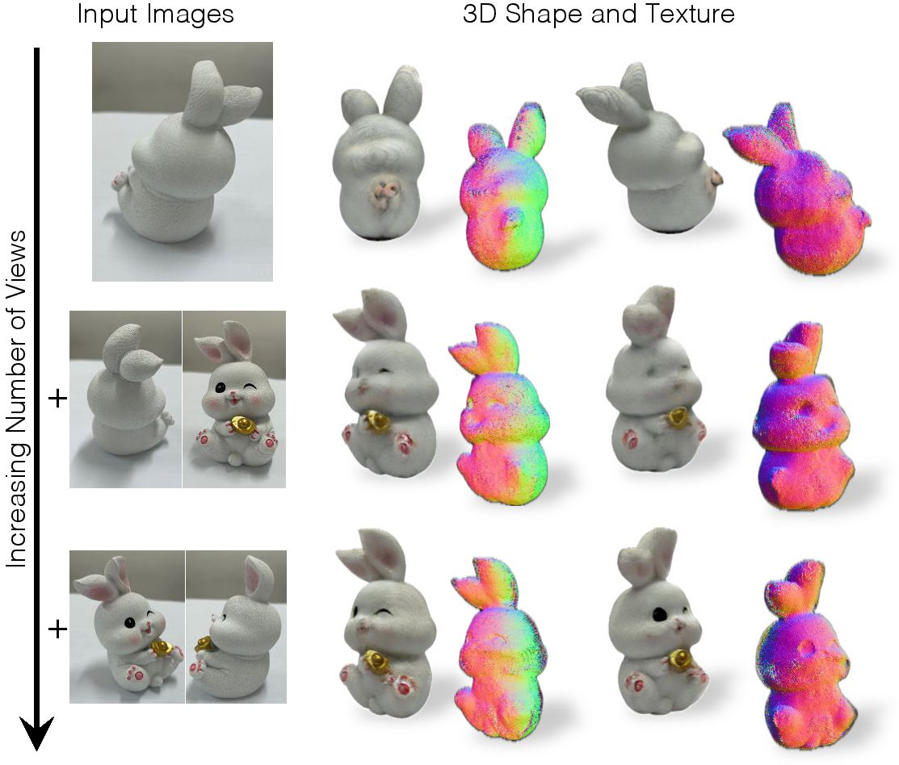
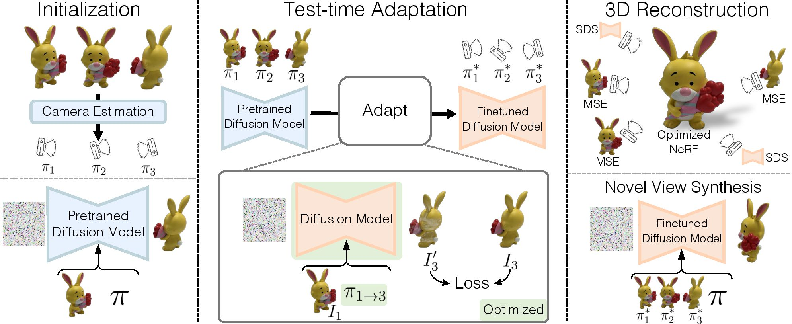

# SAP3D: The More You See in 2D, the More You Perceive in 3D

We present **SAP3D**, which reconstructs the 3D shape and texture of an object with a variable number of real input images. The quality of 3D
shape and texture improve with more views

<p align="center">
  
</p>


> [**The More You See in 2D, the More You Perceive in 3D**](https://SAP3D.github.io/)            
> [Xinyang Han*](https://github.com/XinyangHan), [Zelin Gao*](https://scholar.google.com/citations?user=kvHYP9MAAAAJ&hl=en), [Angjoo Kanazawa](http://people.eecs.berkeley.edu/~kanazawa), [Shubham Goel**](https://shubham-goel.github.io/), [Yossi Gandelsman**](https://yossigandelsman.github.io/)<br>
> Berkeley AI Research, UC Berkeley    
> Preprint

[project page](https://SAP3D.github.io/) | [arxiv]() | [bibtex](#citation)


<!-- ## Features 
- SAP3D is the first universal unsupervised image segmentation model to tackle unsupervised semantic-aware instance, semantic, and panoptic segmentation tasks using a unified framework.
- SAP3D can learn unsupervised object detectors and instance segmentors solely on ImageNet-1K.
- SAP3D exhibits strong robustness to domain shifts when evaluated on 11 benchmarks across domains like natural images, video frames, paintings, sketches, etc.
- SAP3D can serve as a pretrained model for fully/semi-supervised detection and segmentation tasks. -->

## Installation
See [installation instructions](docs/INSTALL.md).

## Dataset Preparation
See [Preparing Datasets for SAP3D](docs/DATASET.md).

## Method Overview
<p align="center">
  
</p>

Overview of SAP3D. We first compute coarse relative camera poses using an off-the-shelf model. We fine-tune a view-conditioned
2D diffusion model on the input images and simultaneously refine the camera poses via optimization. The resulting instance-specific
diffusion model and camera poses enable 3D reconstruction and novel view synthesis from an arbitrary number of input images.

## Pipeline

This pipeline encompasses 3 stages for pose estimation and reconstruction:

1. **Pose Estimation Initialization**: We use scaled-up RelposePP to initialize the poses for the input images.
2. **Pose Refinement and Diffusion Model TTT**: Enhancing the pose estimation with refinement and personalizing diffusion model.
3. **3D Reconstruction**: Reconstruct the 3D object based on estimated poses and finetuned diffusion model.

### System Requirements
- **Memory Considerations**: To ensure a smooth operation, your system should have at least 38GB of available memory.

### Initial Setup
- **Configuring the Working Directory**: Please set your `ROOT_DIR` in the `run_pipeline.sh` script as the first step before launching the pipeline.

### Reconstruction and Evaluation

**Reconstructing Individual Objects**:
To process a specific object, kindly use the command below:
```bash
sh run_pipeline.sh GSO_demo OBJECT_NAME INPUT_VIEWS GPU_INDEX
```
For instance:
```bash
sh run_pipeline.sh GSO_demo MINI_FIRE_ENGINE 5 0
```

**Batch Processing**:
To execute the pipeline for all examples in the `dataset/data/train/GSO_demo` directory, please run:
```bash
python run_pipeline.py --object_type GSO_demo
```

### Results and Numbers
- **2D NVS Outputs**: These can be found in the `camerabooth/experiments_nvs/GSO_demo` directory.
- **3D NVS Outputs**: Look for these in folders named like `3D_Recon/threestudio/experiments_GSO_demo_view_5_nerf`.
- **Evaluation Numbers**: Quantitative results are stored under `results` folder.


## Citation
If you find our work inspiring or use our codebase in your research, please consider giving a star ⭐ and a citation.
```

```


